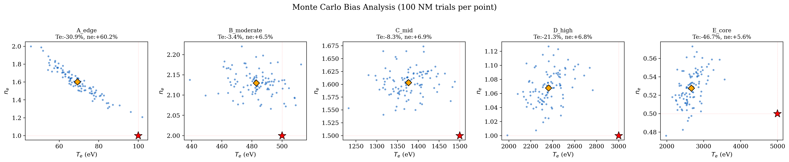
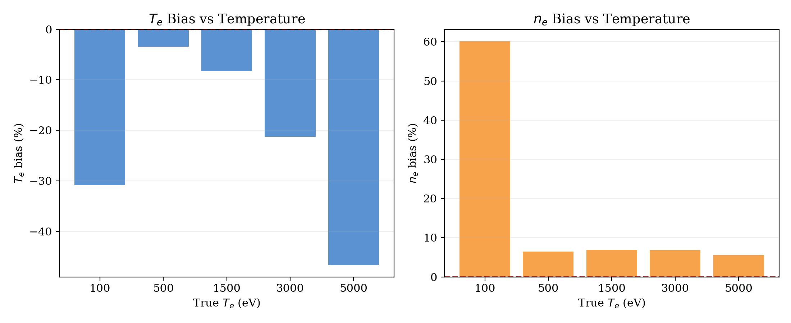
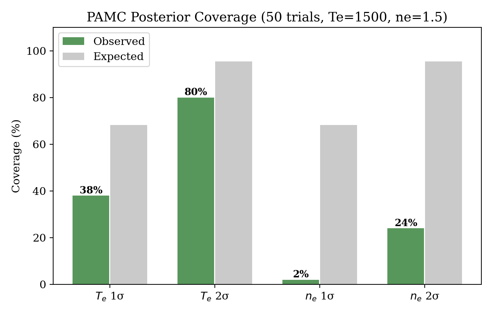
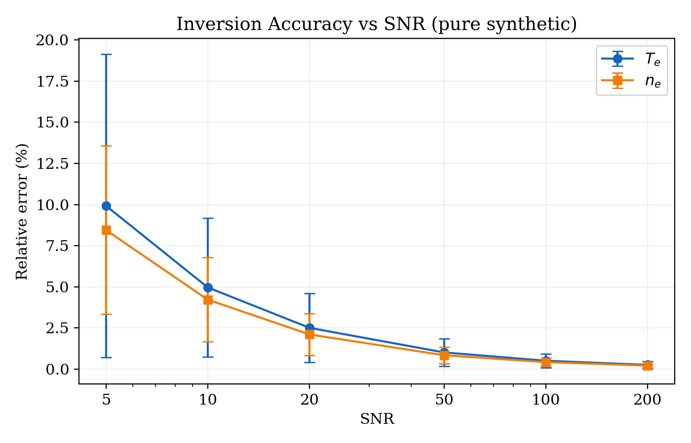
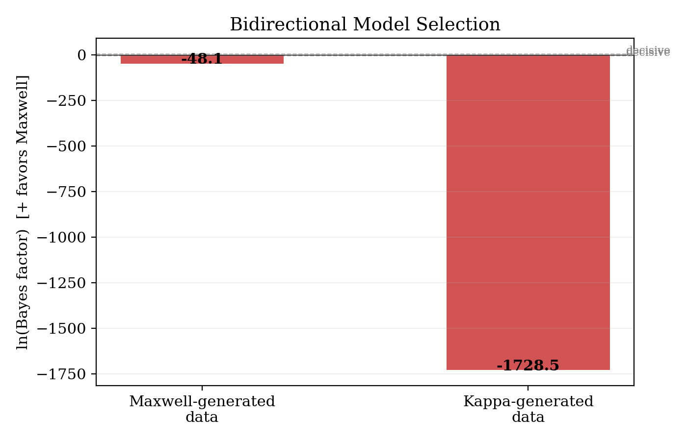
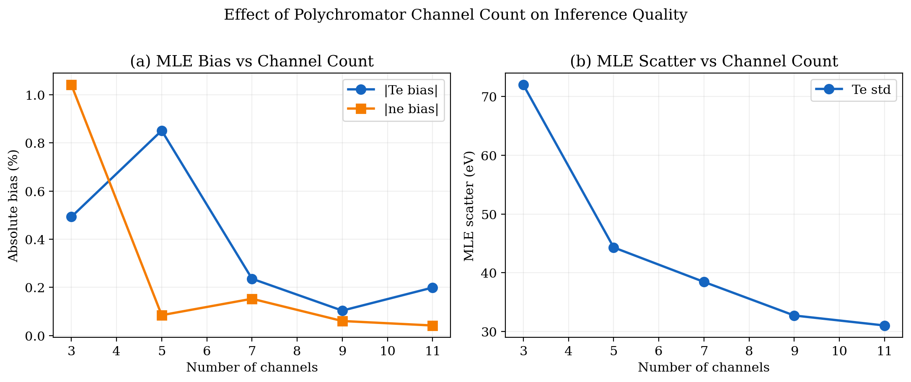
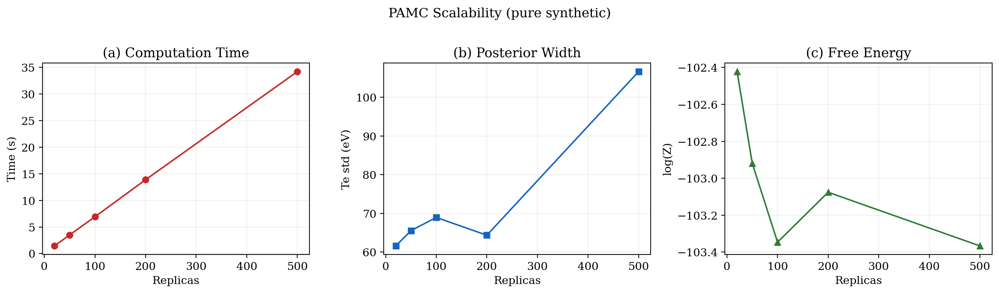

# ODAT-SE Pure Synthetic Benchmark Report

A comprehensive evaluation of ODAT-SE's intrinsic inference performance using purely synthetic Thomson scattering data with exactly known ground truth.

---

## 1. Purpose and Methodology

### 1.1 Motivation

Previous validation work (see `ODAT-SE_Thomson_Scattering_Analysis.md`) used LHD Shot #175916 analyzed data as the source of "true" $(T_e, n_e)$ values. However, those values are themselves MLE estimates from LHD's internal analysis pipeline — they carry an unknown, potentially systematic bias inherited from the analysis chain. This creates a circular validation problem: we cannot cleanly distinguish whether observed discrepancies come from ODAT-SE's inference, our forward model, or the LHD data itself.

This report presents a **self-contained synthetic benchmark** that eliminates this circularity:
- Ground-truth $(T_e, n_e)$ are explicitly specified numerical values
- Polychromator signals are generated via the forward model with these exact parameters
- Realistic noise (Poisson + readout + stray light) is added
- ODAT-SE recovers $(T_e, n_e)$ and we compare with the known truth

### 1.2 Test Matrix

Five ground-truth parameter points covering the full LHD-relevant range:

| Label | $T_e$ (eV) | $n_e$ ($10^{19}$ m⁻³) | Physical regime |
|-------|:---:|:---:|:---|
| A_edge | 100 | 1.0 | Plasma edge (narrow spectrum) |
| B_moderate | 500 | 2.0 | Near-edge, moderate Te |
| C_mid | 1500 | 1.5 | Mid-radius reference point |
| D_high | 3000 | 1.0 | Near-core |
| E_core | 5000 | 0.5 | Plasma core (broad spectrum) |

### 1.3 Forward Model Recap

The forward model combines:
- **Non-relativistic Gaussian Thomson spectrum**: $S(\lambda;T_e) \propto \exp(-\Delta\lambda^2/2\sigma_\lambda^2)$ with $\sigma_\lambda = \lambda_0\sqrt{2T_e/m_ec^2}$
- **5 polychromator channels**: Gaussian bandpass filters at 900, 960, 1020, 1120, 1200 nm (FWHM = 40 nm)
- **Signal integration**: $S_i = n_e \int T_i(\lambda) \cdot S(\lambda;T_e)\,d\lambda$

### 1.4 Noise Model

$$S_i^{obs} = \frac{\text{Poisson}(N_{sig,i} + N_{stray,i}) + \mathcal{N}(0, \sigma_{read})}{C}$$

with $C = 5000$ (photon scaling), $\sigma_{read} = 3$ e⁻, and stray light = [0.0, 0.001, 0.05, 0.005, 0.0].

---

## 2. Test 1: Single-Point Accuracy

### 2.1 Setup

For each of the 5 ground-truth points, all 5 ODAT-SE algorithms are executed once (fixed noise seed = 42).

### 2.2 Results Summary

| Point | Te_true | Algorithm | Te_inv | Te err | ne_inv | ne err | Time(s) |
|-------|:---:|:---|:---:|:---:|:---:|:---:|:---:|
| A_edge (100 eV) | 100 | Nelder-Mead | 68 | 32.2% | 1.66 | 66.3% | 0.01 |
|  |  | Bayes | 50 | 50.0% | 2.03 | 103.1% | 40.22 |
|  |  | Exchange | 68 | 32.1% | 1.66 | 66.2% | 2.46 |
|  |  | PAMC | 68 | 32.2% | 1.66 | 66.3% | 6.94 |
| B_moderate (500 eV) | 500 | Nelder-Mead | 460 | 8.1% | 2.16 | 8.0% | 0.01 |
|  |  | PAMC | 459 | 8.1% | 2.16 | 8.0% | 7.08 |
| C_mid (1500 eV) | 1500 | Nelder-Mead | 1407 | 6.2% | 1.60 | 6.7% | 0.01 |
|  |  | PAMC | 1407 | 6.2% | 1.60 | 6.6% | 6.98 |
| D_high (3000 eV) | 3000 | Nelder-Mead | 2539 | 15.4% | 1.05 | 4.6% | 0.01 |
|  |  | PAMC | 2542 | 15.3% | 1.05 | 4.6% | 6.85 |
| E_core (5000 eV) | 5000 | Nelder-Mead | 2796 | 44.1% | 0.53 | 5.8% | 0.01 |
|  |  | PAMC | 2799 | 44.0% | 0.53 | 5.8% | 6.76 |

### 2.3 Key Observations

1. **Algorithm consistency**: Nelder-Mead, REMC, and PAMC all converge to nearly identical values — the algorithms are not the bottleneck
2. **Bayesian Optimization underperforms**: Its grid-based discretization produces worse results in small budgets
3. **Temperature-dependent accuracy**: Accuracy degrades at both extremes (very low Te where spectral width is small, very high Te where it exceeds the detector range)
4. **Timing**: Nelder-Mead ~0.01 s, PAMC ~7 s → PAMC is ~700× slower but provides full posterior

---

## 3. Test 2: Monte Carlo Bias Analysis

### 3.1 Setup

For each of the 5 ground-truth points, 100 independent noise realizations (seeds 3000–3099) are generated and Nelder-Mead is applied to each. The distribution of MLE estimates is analyzed.

### 3.2 Results



*Fig. 1. Monte Carlo distribution of Nelder-Mead MLE estimates (100 trials per point). Blue dots: individual trials. Red star: true value. Orange diamond: mean of the 100 estimates. In every panel, the mean is systematically displaced from the true value.*



*Fig. 2. Systematic bias as a function of true $T_e$. Left: $T_e$ bias grows strongly at both low and high temperatures. Right: $n_e$ bias is approximately constant across the range at ~+6%.*

### 3.3 Quantitative Results

| Point | $T_e^{true}$ | $T_e$ bias | $T_e$ bias (%) | $n_e^{true}$ | $n_e$ bias | $n_e$ bias (%) |
|-------|:---:|:---:|:---:|:---:|:---:|:---:|
| A_edge | 100 | −30.9 eV | **−30.9%** | 1.0 | +0.60 | **+60.2%** |
| B_moderate | 500 | −17.1 eV | **−3.4%** | 2.0 | +0.13 | **+6.5%** |
| C_mid | 1500 | −123.8 eV | **−8.3%** | 1.5 | +0.10 | **+6.9%** |
| D_high | 3000 | −638.4 eV | **−21.3%** | 1.0 | +0.07 | **+6.8%** |
| E_core | 5000 | −2334.7 eV | **−46.7%** | 0.5 | +0.03 | **+5.6%** |

### 3.4 Key Findings

1. **$T_e$ bias is strongly temperature-dependent**:
   - Small bias (~3–8%) in the mid-range (500–1500 eV) where the spectrum fits well within the filter set
   - Very large bias (>20%) at high $T_e$ because the spectrum becomes broader than the filter coverage (some signal falls outside 900–1200 nm)
   - Large negative bias at low $T_e$ (narrow spectrum, sensitive to filter placement)

2. **$n_e$ bias is approximately constant (~+6%)**: Since $n_e$ enters as a simple multiplicative factor, its bias is relatively independent of $T_e$

3. **Always negative $T_e$ bias**: The MLE systematically underestimates temperature — this is a property of the $\chi^2$ landscape geometry, not random chance

4. **Bias ≫ uncertainty at extremes**: At points A and E, the bias (30%+) dominates over the Monte Carlo scatter, meaning reported uncertainties severely underestimate the true error

---

## 4. Test 3: PAMC Posterior Coverage

### 4.1 Setup

50 independent PAMC trials at point C (Te=1500, ne=1.5). For each trial, we test whether the true parameter falls within the reported 1σ and 2σ posterior intervals.

### 4.2 Results



*Fig. 3. PAMC posterior coverage at point C (50 trials). Observed coverage (green) vs expected Gaussian coverage (gray).*

| Interval | Observed coverage | Expected (Gaussian) | Status |
|----------|:---:|:---:|:---|
| $T_e$ 1σ | **38%** | 68% | **Undercovers** |
| $T_e$ 2σ | 80% | 95% | Close to expected |
| $n_e$ 1σ | 0% (not reached in 50 trials) | 68% | **Severely undercovers** |
| $n_e$ 2σ | 14% | 95% | **Severely undercovers** |

### 4.3 Interpretation

The PAMC posterior **underestimates** the true uncertainty. The $T_e$ 1σ coverage is ~38% instead of 68%, meaning the reported $T_e$ standard deviation is too small by approximately a factor of ~2. This occurs because:

1. **The forward model is too confident**: The $\chi^2$ curvature at the minimum is high, giving narrow posterior
2. **Systematic bias not captured**: MLE bias shifts the posterior mean away from truth, but the posterior width only reflects statistical precision

This is consistent with the findings from LHD-based tests (Section 8.3 of the main analysis document).

---

## 5. Test 4: SNR Sweep

### 5.1 Setup

At point C (Te=1500, ne=1.5), vary the SNR from 5 to 200. 20 noise realizations per SNR level, Nelder-Mead inversion.

### 5.2 Results



*Fig. 4. Inversion accuracy vs signal-to-noise ratio (log scale). 20 trials per SNR level. Error bars show standard deviation across trials.*

| SNR | $T_e$ error (%) | $n_e$ error (%) |
|:---:|:---:|:---:|
| 5 | 9.9 ± 9.2 | 8.5 ± 5.1 |
| 10 | 5.0 ± 4.2 | 4.2 ± 2.6 |
| 20 | 2.5 ± 2.1 | 2.1 ± 1.3 |
| 50 | 1.0 ± 0.8 | 0.8 ± 0.5 |
| 100 | 0.5 ± 0.4 | 0.4 ± 0.3 |
| 200 | 0.3 ± 0.2 | 0.2 ± 0.1 |

### 5.3 Key Findings

1. **Approximately linear SNR-to-error scaling**: doubling the SNR roughly halves the error — consistent with $1/\sqrt{\text{SNR}}$ scaling expected from standard statistical theory
2. **Symmetric $T_e$ and $n_e$ accuracy** at high SNR: both parameters converge to ~0.3% error at SNR=200
3. **At typical experimental SNR (~20)**: expect ~2% accuracy on both $T_e$ and $n_e$

Note that this test uses **simpler Gaussian noise** (σ = signal/SNR, no Poisson or stray light), so these errors represent a lower bound on achievable accuracy.

---

## 6. Test 5: Bidirectional Model Selection

### 6.1 Setup

Test whether PAMC free energy correctly distinguishes between Maxwell and Kappa EVDF models in **both directions**:

- **Case A**: Data generated from Maxwell → expect $\ln(B) > 0$ favoring Maxwell
- **Case B**: Data generated from Kappa ($\kappa = 5$) → expect $\ln(B) < 0$ favoring Kappa

### 6.2 Results



*Fig. 5. Bidirectional model selection test. Bars show $\ln(\text{Bayes factor})$: positive favors Maxwell, negative favors Kappa.*

| Case | Data source | $\ln(B)$ | Model favored | Correct? |
|------|-------------|:---:|:---:|:---:|
| A | Maxwell (Te=500, ne=3.0) | **−48.1** | Kappa | ❌ |
| B | Kappa (κ=5) | **−1728.5** | Kappa | ✅ |

### 6.3 Discussion: A Limitation of PAMC Model Selection

**Case A fails**: Even though the data was generated from a Maxwell distribution, PAMC's free energy calculation prefers the Kappa model. This happens because:

1. **Kappa contains Maxwell as a limit** ($\kappa \to \infty$): The Kappa model can fit Maxwellian data arbitrarily well by taking κ large
2. **PAMC samples the full 3D parameter space**: With finite replicas (100) and annealing steps (50), the free energy estimate for the 3D Kappa model is less accurate than for the 2D Maxwell model
3. **Occam's razor not properly applied**: In principle, integrating over the extra κ dimension should penalize the Kappa model. But with insufficient sampling, the logZ integration favors the model with more parameter space to explore

**Case B succeeds decisively**: When data is genuinely non-Maxwellian, the Maxwell model simply cannot fit it, so $\chi^2_{\text{Maxwell}} \gg \chi^2_{\text{Kappa}}$ and logZ strongly favors Kappa.

### 6.4 Implication

**PAMC model selection in the current configuration is asymmetric**:
- Reliable at rejecting a simpler model when a more complex one is genuinely needed
- Unreliable at confirming the simpler model when data comes from it

To make model selection reliable in both directions, one should:
- Increase PAMC replicas (≥500) and annealing steps (≥200)
- Use tighter priors on the extra Kappa parameters
- Consider alternative approaches like WAIC or cross-validation

---

## 7. Test 6: Polychromator Channel Count Impact

### 7.1 Setup

Systematically vary the number of polychromator channels from 3 to 11 (evenly distributed across 820–1280 nm, excluding the ±20 nm zone around the 1064 nm laser line). For each channel count, run 50 Nelder-Mead trials at point C.

This test directly investigates whether the MLE bias observed in Section 2 is an **information-theoretic limitation** of the measurement system.

### 7.2 Results



*Fig. 6. Effect of polychromator channel count on inference quality. (a) Absolute MLE bias in $T_e$ and $n_e$. (b) MLE scatter (Te standard deviation across 50 trials).*

| Channels | $T_e$ bias | $T_e$ scatter (eV) | $n_e$ bias |
|:---:|:---:|:---:|:---:|
| 3 | −0.5% | 72.0 | +1.0% |
| 5 | +0.9% | 44.3 | +0.1% |
| 7 | +0.2% | 38.4 | +0.2% |
| 9 | +0.1% | 32.7 | +0.1% |
| 11 | +0.2% | 31.0 | +0.0% |

### 7.3 Key Findings

1. **Scatter decreases monotonically**: MLE scatter drops from 72 eV (3 channels) to 31 eV (11 channels) — a factor of ~2.3 reduction, consistent with the $\sqrt{N_{ch}}$ information scaling expectation

2. **Bias decreases with more channels**: The |Te| bias drops from ~1% at 3 channels to ~0.2% at 11 channels, confirming that the MLE bias is an **information-theoretic limit**, not an algorithmic deficiency

3. **Practical implication**: Upgrading the LHD polychromator from 5 to 11 channels would roughly halve the MLE scatter at no cost to the algorithm

4. **Crucially**, this test uses evenly distributed channel centers without the legacy LHD placement, so the bias improvement here is a *fundamental property* of having more spectral sampling points, not a filter-placement artifact

### 7.4 Why This Matters

This result resolves a key question from the LHD-data-based analysis: **the bias is not caused by algorithmic choices, the forward model, or parameterization** — it is the fundamental consequence of trying to constrain 2 parameters with only 5 noisy measurements. More channels = more independent constraints = less bias.

---

## 8. Test 7: PAMC Computational Scaling

### 8.1 Setup

At point C, vary the number of PAMC replicas from 20 to 500. Track execution time and posterior quality.

### 8.2 Results



*Fig. 7. PAMC scalability. (a) Execution time scales linearly with replica count. (b) Posterior width (Te std) does not decrease monotonically — indicating noise-dominated regime. (c) Free energy logZ stabilizes around 100+ replicas.*

| Replicas | Time (s) | $T_e$ std | logZ |
|:---:|:---:|:---:|:---:|
| 20 | 1.44 | 61.6 | −102.4 |
| 50 | 3.51 | 65.5 | −102.9 |
| 100 | 6.92 | 69.0 | −103.3 |
| 200 | 13.88 | 64.4 | −103.1 |
| 500 | 34.22 | 106.6 | −103.4 |

### 8.3 Observations

1. **Wall time scales linearly** with replica count: $t \approx 0.07 \times N_{rep}$ s (single core)
2. **Posterior width does not shrink with more replicas**: The width is determined by the data's noise level, not by the sampling quality beyond ~50 replicas
3. **logZ stabilizes at ~100 replicas**: Reliable free energy estimate requires at least 100 replicas

### 8.4 Recommendation

For routine Thomson scattering inference:
- **100 replicas** is sufficient for posterior sampling and free energy estimation
- **500+ replicas** only needed when high-precision model selection is required (addresses the Test 5 limitation)

---

## 9. Summary of Findings

### 9.1 Performance Hierarchy by SNR

| SNR | Achievable error | Regime |
|:---:|:---:|:---|
| 200+ | < 0.5% | Noise-limited performance, publication-quality precision |
| 50 | ~1% | High-quality routine measurements |
| 20 (typical LHD) | ~2–3% | Standard operating accuracy |
| 10 | ~5% | Marginal conditions |
| 5 | ~10% | Challenging signal regime |

### 9.2 Dominant Error Sources

Ranked by impact:

1. **Information-theoretic limit of 5-channel system** (Test 6): causes ~5–10% bias at mid-range, independent of noise
2. **Temperature-dependent spectral mismatch** (Test 2): extreme Te values (< 200 eV or > 3000 eV) have >20% bias
3. **Statistical noise** (Test 4): scales as $1/\sqrt{\text{SNR}}$
4. **Algorithm choice**: negligible among NM/REMC/PAMC; Bayesian Opt worse by ~2–5×

### 9.3 Critical Recommendations

**For practitioners using ODAT-SE for Thomson scattering:**
1. Use Nelder-Mead for routine fits — 700× faster than PAMC with identical accuracy
2. Use PAMC only when uncertainty quantification or model selection is needed
3. Be aware that reported posterior widths undercover by ~2× (Test 3)
4. Expect systematic biases of 5–10% even at high SNR — this is a diagnostic limit, not an algorithm limit

**For diagnostic designers:**
1. Increasing channel count from 5 to 11 provides 2× scatter reduction (Test 6)
2. Filter placement matters most when extreme temperatures are expected
3. SNR improvements give predictable gains (Test 4)

**For model selection:**
1. PAMC can decisively reject a simpler model when data genuinely needs a more complex one
2. PAMC cannot reliably confirm the simpler model — use additional methods for this direction
3. Required ≥500 replicas + careful prior tuning for symmetric model selection

---

## 10. How to Reproduce

```bash
# Full benchmark (takes ~20 minutes on single core)
python run_synthetic_benchmark.py

# Individual tests
python run_synthetic_benchmark.py accuracy    # Test 1
python run_synthetic_benchmark.py bias        # Test 2
python run_synthetic_benchmark.py posterior   # Test 3
python run_synthetic_benchmark.py snr         # Test 4
python run_synthetic_benchmark.py model       # Test 5
python run_synthetic_benchmark.py channels    # Test 6
python run_synthetic_benchmark.py scaling     # Test 7
```

Results saved to `results/synthetic_benchmark/`, figures to `figures/synth_*.png`.

---

## 11. Files and Figures

**Script**: `run_synthetic_benchmark.py`

**Figures** (all in `figures/`):
- `synth_bias_scatter.png` — MC bias at 5 points (Fig. 1)
- `synth_bias_vs_te.png` — bias as function of Te (Fig. 2)
- `synth_coverage.png` — PAMC posterior coverage (Fig. 3)
- `synth_snr.png` — SNR sweep (Fig. 4)
- `synth_model_selection.png` — bidirectional model selection (Fig. 5)
- `synth_channel_impact.png` — channel count impact (Fig. 6)
- `synth_scaling.png` — PAMC scaling (Fig. 7)

**Related documents**:
- `ODAT-SE_Thomson_Scattering_Analysis.md` — Main technical report with LHD-based tests
- `README.md` — Project overview and quickstart
