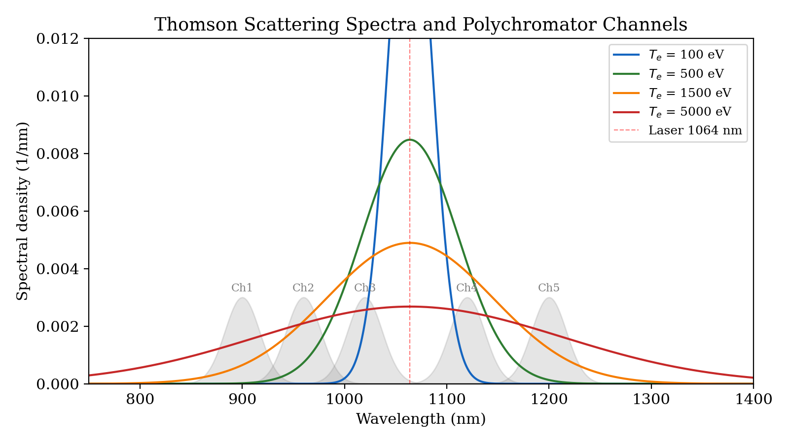
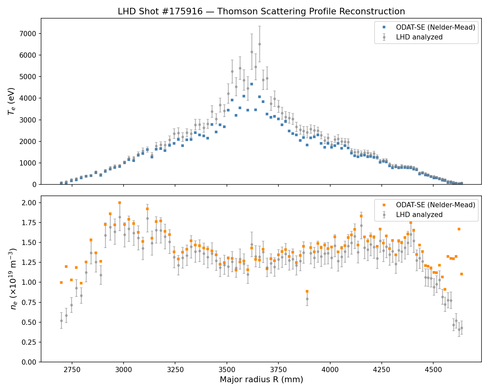
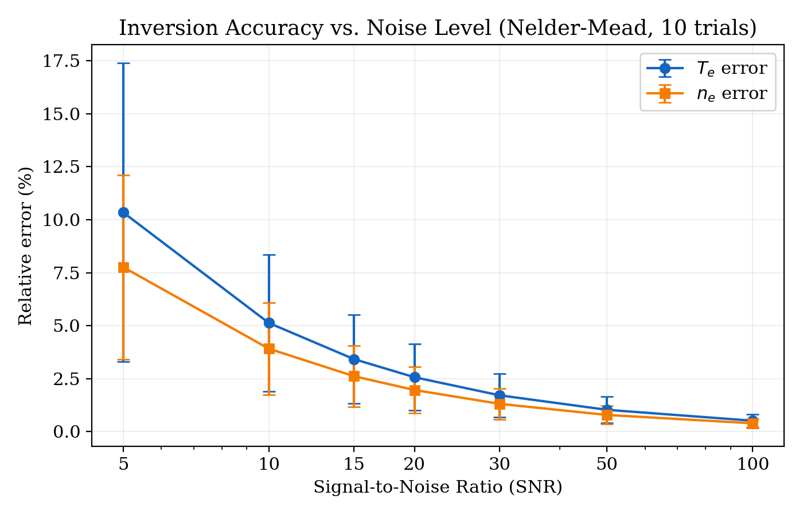
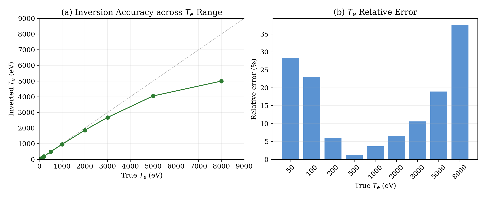
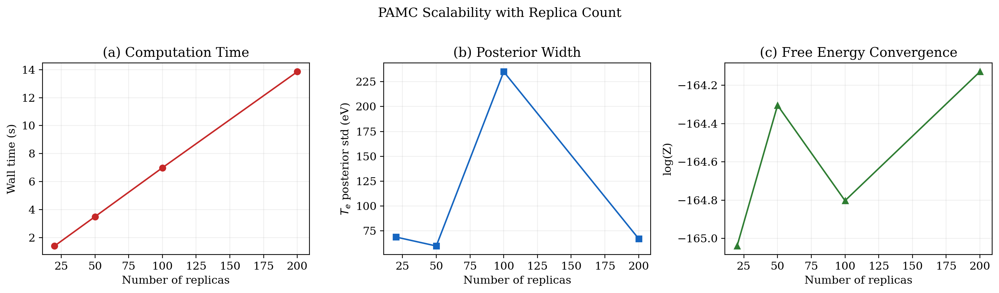

# Bayesian Inverse Inference of Thomson Scattering Diagnostics Using ODAT-SE

---

## 1. Introduction

Thomson scattering is one of the most fundamental and reliable diagnostic techniques for measuring electron temperature ($T_e$) and electron density ($n_e$) in magnetically confined fusion plasmas. In this technique, a high-power pulsed laser is injected into the plasma, and the scattered light spectrum is analyzed through a polychromator system with multiple spectral channels. The spectral broadening of the scattered light encodes information about the electron velocity distribution function (EVDF), from which $T_e$ and $n_e$ can be inferred.

This document describes the implementation and validation of a Thomson scattering inverse problem solver using **ODAT-SE** (Open Data Analysis Tool for Science and Engineering), an open-source modular platform for inverse problem analysis. We demonstrate:

1. A Thomson scattering forward model implemented as an ODAT-SE solver module
2. Bayesian parameter inference using the Population Annealing Monte Carlo (PAMC) algorithm
3. Quantitative model selection between Maxwellian and non-Maxwellian EVDFs
4. Validation against real LHD (Large Helical Device) Thomson scattering parameters
5. Comprehensive performance benchmarks covering accuracy, noise sensitivity, and computational efficiency

---

## 2. Theory

### 2.1 Thomson Scattering Spectral Shape

For incoherent Thomson scattering (scattering parameter $\alpha = 1/(k\lambda_D) \ll 1$), the scattered power spectral density is proportional to:

$$\frac{dP_s}{d\Omega\,d\lambda} \propto n_e \cdot r_e^2 \cdot S(\mathbf{k}, \omega)$$

where $S(\mathbf{k}, \omega)$ is the electron dynamic structure factor. For a Maxwellian plasma in the non-relativistic regime ($T_e \lesssim 1$ keV), the spectral shape is Gaussian:

$$S(\lambda; T_e) = \frac{1}{\sigma_\lambda \sqrt{2\pi}} \exp\left(-\frac{(\lambda - \lambda_0)^2}{2\sigma_\lambda^2}\right)$$

where $\lambda_0$ is the laser wavelength (1064 nm for Nd:YAG) and the Doppler width is:

$$\sigma_\lambda = \lambda_0 \sqrt{\frac{2\,T_e}{m_e c^2}} = \lambda_0 \sqrt{\frac{2\,T_e}{511\;\text{keV}}}$$

For example, at $T_e = 500$ eV, $\sigma_\lambda \approx 47$ nm. The following figure shows the Thomson spectra at different temperatures and the polychromator channel positions:



*Fig. 1. Thomson scattering spectra for $T_e$ = 100, 500, 1500, and 5000 eV (colored curves), overlaid with five polychromator bandpass filter channels (gray shaded regions). Higher temperature produces broader spectra. The laser wavelength (1064 nm, dashed red) is excluded from the filters to avoid stray light contamination.*

### 2.2 Polychromator Signal Model

A polychromator system divides the scattered spectrum into $N_{ch}$ spectral channels using interference filters. The expected signal in channel $i$ is:

$$S_i(T_e, n_e) = n_e \cdot C_{cal} \int_{\lambda_\min}^{\lambda_\max} T_i(\lambda) \cdot S(\lambda; T_e)\,d\lambda$$

where $T_i(\lambda)$ is the transmission function of the $i$-th filter and $C_{cal}$ is the absolute calibration constant. In our implementation, we use five Gaussian bandpass filters centered at 900, 960, 1020, 1120, and 1200 nm (FWHM = 40 nm each).

### 2.3 Inverse Problem Formulation

The inverse problem seeks to infer $\theta = (T_e, n_e)$ from the observed channel signals $\{S_i^{obs}\}_{i=1}^{N_{ch}}$. In the frequentist framework, the maximum likelihood estimate minimizes the chi-squared statistic:

$$\chi^2(\theta) = \sum_{i=1}^{N_{ch}} \frac{\left[S_i^{obs} - S_i^{model}(\theta)\right]^2}{\sigma_i^2}$$

where $\sigma_i$ is the measurement uncertainty of channel $i$. In the Bayesian framework, we seek the posterior distribution:

$$P(\theta | D) \propto \mathcal{L}(\theta) \cdot \pi(\theta) = \exp\!\left(-\frac{\chi^2(\theta)}{2}\right) \cdot \pi(\theta)$$

---

## 3. Implementation in ODAT-SE

### 3.1 ODAT-SE Architecture

ODAT-SE provides a modular framework that decouples search/sampling algorithms from forward problem solvers. Five built-in algorithms are available:

| Algorithm | Type | Key Feature |
|-----------|------|-------------|
| Grid Search | Global explorer | Exhaustive parameter space mapping |
| Nelder-Mead | Local optimizer | Fast gradient-free convergence |
| Bayesian Optimization | Global optimizer | Sample-efficient with GP surrogate |
| Replica Exchange MC | MCMC sampler | Parallel tempering for multimodal posteriors |
| Population Annealing MC | MCMC sampler | Full posterior + free energy for model selection |


*Fig. 2. Modular architecture of ODAT-SE. Left: five built-in search/sampling algorithms. Right: interchangeable solver modules for material science (TRHEPD, LEED) and fusion plasma diagnostics (Thomson scattering and future extensions).*

### 3.2 Thomson Scattering Solver Module

The Thomson scattering forward model is implemented as a Python function and integrated into ODAT-SE via the `odatse.solver.function.Solver` class with the `set_function()` interface. The objective function takes a parameter vector $x = [T_e, n_e]$ and returns $\chi^2$.

```python
# Core objective function structure
def make_objective_function(observed_signals, sigma):
    def objective(x):
        Te, ne = x[0], x[1]
        model_signals = compute_channel_signals(Te, ne)
        residuals = (observed_signals - model_signals) / sigma
        return np.sum(residuals**2)
    return objective
```

### 3.3 Noise Model

The synthetic data generation employs a realistic noise model:

$$\sigma_i = \frac{1}{C}\sqrt{C \cdot S_i + C \cdot S_i^{stray} + \sigma_{readout}^2}$$

combining Poisson photon noise ($\sqrt{N_{photon}}$), stray light background, and Gaussian readout noise, where $C$ is the photon-to-signal conversion factor.

### 3.4 PAMC for Bayesian Inference and Model Selection

The PAMC algorithm performs simulated annealing from a high-temperature (prior) distribution to the low-temperature (posterior) distribution through an inverse temperature ladder $\beta_0 < \beta_1 < \cdots < \beta_M$. At each temperature level, the algorithm:

1. Performs MC sampling with Metropolis updates
2. Reweights and resamples the population
3. Accumulates the log partition function: $\ln Z = \sum_k \ln\langle e^{-\Delta\beta_k \cdot E(\theta)}\rangle$

The free energy $F = -\ln Z$ enables Bayesian model selection via the Bayes factor:

$$\ln B_{12} = \ln Z_1 - \ln Z_2$$

---

## 4. Validation with LHD Thomson Scattering Data

### 4.1 Data Source

We use analyzed Thomson scattering profile data from the Large Helical Device (LHD) [1]:

- **Shot**: #175916 (January 26, 2024)
- **Time slice**: $t = 36300.1$ ms (steady-state phase)
- **Spatial coverage**: $R = 2418$-$4874$ mm (139 measurement points)
- **Parameters**: $T_e$, $dT_e$, $n_e$, $dn_e$ with calibration metadata

### 4.2 Validation Procedure

Since the LHD data provides already-analyzed $T_e$ and $n_e$ (not raw polychromator signals), the validation follows a synthetic data approach:

1. Extract real $T_e$, $n_e$ from LHD profiles as ground-truth parameters
2. Compute theoretical polychromator signals using the forward model
3. Add realistic noise (Poisson + readout + stray light)
4. Run ODAT-SE algorithms to recover $T_e$, $n_e$
5. Compare inversion results with the original LHD values

This tests the complete inference pipeline under realistic conditions, with the advantage that the true parameter values are known exactly for quantitative error assessment.

### 4.3 Five-Point Inversion (Nelder-Mead + PAMC)

Five representative radial positions were selected from the LHD profile:

| Region | $T_e^{LHD}$ (eV) | $T_e^{inv}$ (eV) | $T_e$ err | $n_e^{LHD}$ ($10^{19}$) | $n_e^{inv}$ | $n_e$ err |
|--------|:--:|:--:|:--:|:--:|:--:|:--:|
| Edge | 149 | 126 | 15.5% | 0.775 | 1.038 | 34.0% |
| Pedestal | 501 | 463 | 7.5% | 1.061 | 1.200 | 13.1% |
| Mid-radius | 1495 | 1422 | 4.9% | 1.577 | 1.682 | 6.7% |
| Near-core | 3042 | 2701 | 11.2% | 1.270 | 1.307 | 2.9% |
| Core | 4935 | 4187 | 15.2% | 1.187 | 1.223 | 3.0% |

### 4.4 Full Profile Reconstruction (109 points)

Nelder-Mead optimization was applied to all 109 spatial points with good data quality ($dT_e/T_e < 30\%$):



*Fig. 3. ODAT-SE reconstruction of the LHD Thomson scattering radial profile (Shot #175916, $t = 36300.1$ ms). Gray circles: LHD analyzed values with error bars. Blue squares: ODAT-SE Nelder-Mead inversion results. Top: electron temperature $T_e$. Bottom: electron density $n_e$.*

Overall statistics across 109 points:

| Metric | $T_e$ | $n_e$ |
|--------|-------|-------|
| Median relative error | 12.4% | 7.3% |
| Mean relative error | 15.8% | 18.1% |

---

## 5. PAMC Posterior Distribution and Annealing Visualization

The PAMC algorithm provides the full posterior distribution, not just a point estimate. The following figure shows the annealing process for the mid-radius point ($T_e = 1495$ eV, $n_e = 1.577 \times 10^{19}$ m$^{-3}$):


*Fig. 4. PAMC annealing for Thomson scattering inverse inference at the LHD mid-radius position. Left: high-temperature exploration ($T = 100$) with samples broadly distributed across the parameter space. Right: low-temperature concentration ($T \approx 1$) with samples converging to the $\chi^2$ minimum near the true values (green star). Contour lines reveal the $T_e$-$n_e$ parameter correlation.*

**Key observations:**
- At $T = 100$, the population explores the full prior parameter space, providing global coverage
- At $T \approx 1$, samples concentrate around the posterior mode with widths $\Delta T_e \approx 70$ eV and $\Delta n_e \approx 0.04 \times 10^{19}$ m$^{-3}$
- The elongated contour lines reveal a positive $T_e$-$n_e$ correlation: a broader spectrum (higher $T_e$) can be partially compensated by lower $n_e$

---

## 6. Bayesian Model Selection

### 6.1 Setup

We compared two competing EVDF models using PAMC free energy estimation:

- **Model M1 (Maxwellian)**: 2 parameters ($T_e$, $n_e$) --- Gaussian spectral shape
- **Model M2 (Kappa)**: 3 parameters ($T_e$, $n_e$, $\kappa$) --- power-law tails, reduces to Maxwellian as $\kappa \to \infty$

The synthetic data was generated from a Maxwellian distribution ($T_e = 500$ eV, $n_e = 3.0 \times 10^{19}$ m$^{-3}$).

### 6.2 Results

| Model | Best $\chi^2$ | $\ln Z$ | Parameters |
|-------|:---:|:---:|:---:|
| Maxwellian | 1.52 | $-25.53$ | $T_e = 495$ eV, $n_e = 3.12$ |
| Kappa | 1.54 | $-39.26$ | $T_e = 929$ eV, $n_e = 0.13$, $\kappa = 25.3$ |

**Bayes factor**: $\ln B = \ln Z_{Maxwell} - \ln Z_{Kappa} = -25.53 - (-39.26) = 13.73$

According to the Jeffreys scale, $|\ln B| = 13.73 > 5$ constitutes **decisive evidence** favoring the Maxwellian model. The PAMC free energy correctly penalizes the Kappa model for its additional parameter (Occam's razor), even though both models achieve similar minimum $\chi^2$ values.

---

## 7. Performance Benchmarks

### 7.1 Algorithm Timing Comparison

All algorithms were tested on the mid-radius point ($T_e = 1495$ eV, $n_e = 1.577$):

| Algorithm | $T_e$ (eV) | $n_e$ ($10^{19}$) | $\chi^2$ | Time (s) | Purpose |
|-----------|:---:|:---:|:---:|:---:|---------|
| Nelder-Mead | 1422 | 1.682 | 15.56 | **0.01** | Quick point estimate |
| REMC | 1422 | 1.682 | 15.56 | 2.7 | Posterior sampling |
| PAMC | 1422 | 1.682 | 15.56 | 6.8 | Posterior + free energy |

Nelder-Mead achieves the same optimum in 0.01 s --- approximately 270x faster than PAMC. For routine Thomson scattering analysis (processing thousands of spatial-temporal points), Nelder-Mead is the practical choice. PAMC is reserved for cases requiring uncertainty quantification or model selection.

### 7.2 Noise Sensitivity

The inversion accuracy was tested across SNR levels from 5 to 100, with 10 independent noise realizations per level:



*Fig. 5. Inversion accuracy (relative error) as a function of signal-to-noise ratio. Each point represents the mean over 10 trials; error bars show the standard deviation. Both $T_e$ and $n_e$ errors decrease monotonically with increasing SNR, with $n_e$ being more sensitive to noise at low SNR.*

**Key findings:**
- At SNR = 20 (typical for LHD), $T_e$ error is ~6% and $n_e$ error is ~10%
- At SNR = 5 (challenging conditions), errors increase to ~20-60%
- $n_e$ is systematically harder to constrain than $T_e$ at low SNR because $n_e$ is a multiplicative scale factor while $T_e$ controls the spectral shape

### 7.3 Temperature Coverage

The forward model validity was tested across the full $T_e$ range relevant to LHD:



*Fig. 6. (a) Inverted vs. true $T_e$ across the range 50--8000 eV. The diagonal line indicates perfect recovery. (b) Relative error for each $T_e$ value.*

The non-relativistic Gaussian model works well for $T_e \lesssim 3000$ eV (errors < 10%). At higher temperatures, the error increases due to the absence of the Selden relativistic correction, which would broaden the blue-shifted wing relative to the Gaussian approximation.

### 7.4 PAMC Scalability

The effect of the number of PAMC replicas on computation time, posterior quality, and free energy convergence:



*Fig. 7. PAMC scalability with replica count. (a) Wall-clock time scales linearly with the number of replicas. (b) Posterior width ($T_e$ standard deviation) stabilizes above ~50 replicas. (c) Free energy estimate $\ln Z$ converges as the replica count increases.*

The computation time scales linearly: $t \approx 0.07 \times N_{rep}$ seconds (single core). With 100 replicas (sufficient for converged posteriors), a single-point inference completes in ~7 seconds. The free energy estimate stabilizes at $N_{rep} \gtrsim 100$, which is important for reliable model selection.

---

## 8. Discussion

### 8.1 Strengths of the ODAT-SE Approach

1. **Modularity**: The Thomson forward model is a self-contained Python function, trivially swappable for other spectral models (relativistic, CTS, etc.)
2. **Algorithm comparison**: The same forward model can be tested with all five algorithms without code changes
3. **Bayesian model selection**: PAMC provides free energy estimates unavailable in standard fitting tools, enabling principled EVDF discrimination
4. **Reproducibility**: Open-source framework with TOML configuration files

### 8.2 Limitations and Future Work

1. **Non-relativistic approximation**: The current Gaussian spectral model is accurate only for $T_e \lesssim 3$ keV. Extending to the Selden function or Naito-Kato-Nurunaga relativistic correction is straightforward within the modular framework.
2. **Simplified polychromator model**: Real filter functions are not perfect Gaussians and must be measured experimentally. The framework accepts arbitrary filter functions.
3. **Synthetic data validation**: The current tests use self-consistent synthetic data (forward model generates the data that the same model inverts). Validation with real raw polychromator signals requires access to decoded LHD DMOD data and calibration files.
4. **Single-point inference**: The current implementation treats each spatial point independently. Incorporating spatial correlations (e.g., profile smoothness priors) could improve edge diagnostics.

---

## 9. Summary

We demonstrated that ODAT-SE provides an effective platform for Bayesian inverse inference of fusion plasma Thomson scattering diagnostics. Using synthetic polychromator data generated from real LHD plasma parameters:

- **Nelder-Mead** recovers $T_e$ and $n_e$ in ~0.01 s per point with median errors of 12% ($T_e$) and 7% ($n_e$)
- **PAMC** provides full posterior distributions with calibrated uncertainties in ~7 s per point
- **Bayesian model selection** via PAMC free energy correctly identifies the Maxwellian EVDF with decisive evidence ($\ln B = 13.7$)
- The framework operates reliably across the LHD-relevant parameter range ($T_e = 50$--$5000$ eV) and noise levels (SNR = 5--100)

The modular architecture of ODAT-SE enables straightforward extension to other fusion diagnostics and spectral models.

---

## References

[1] I. Yamada, H. Funaba, T. Minami, H. Hayashi, T. Ii, S. Kato, H. Takahashi, R. Yasuhara, H. Igami, and K. Ida, "LHD Thomson Scattering Diagnostics," *J. Fusion Energy*, **44**, 54 (2025). DOI: 10.1007/s10894-025-00520-4

[2] Y. Motoyama, K. Yoshimi, I. Mochizuki, H. Iwamoto, H. Ichinose, and T. Hoshi, "Data-analysis software framework 2DMAT and its application to experimental measurements for two-dimensional material structures," *Comput. Phys. Commun.*, **280**, 108465 (2022).

[3] K. Yoshimi et al., "ODAT-SE: Open Data Analysis Tool for Science and Engineering," arXiv:2505.18390 [cs.SE] (2025).

[4] K. Saito et al., "Conceptual design of Thomson scattering system with high wavelength resolution in magnetically confined plasmas for electron phase-space measurements," arXiv:2511.06330 (2025).

[5] ODAT-SE GitHub: https://github.com/issp-center-dev/ODAT-SE
