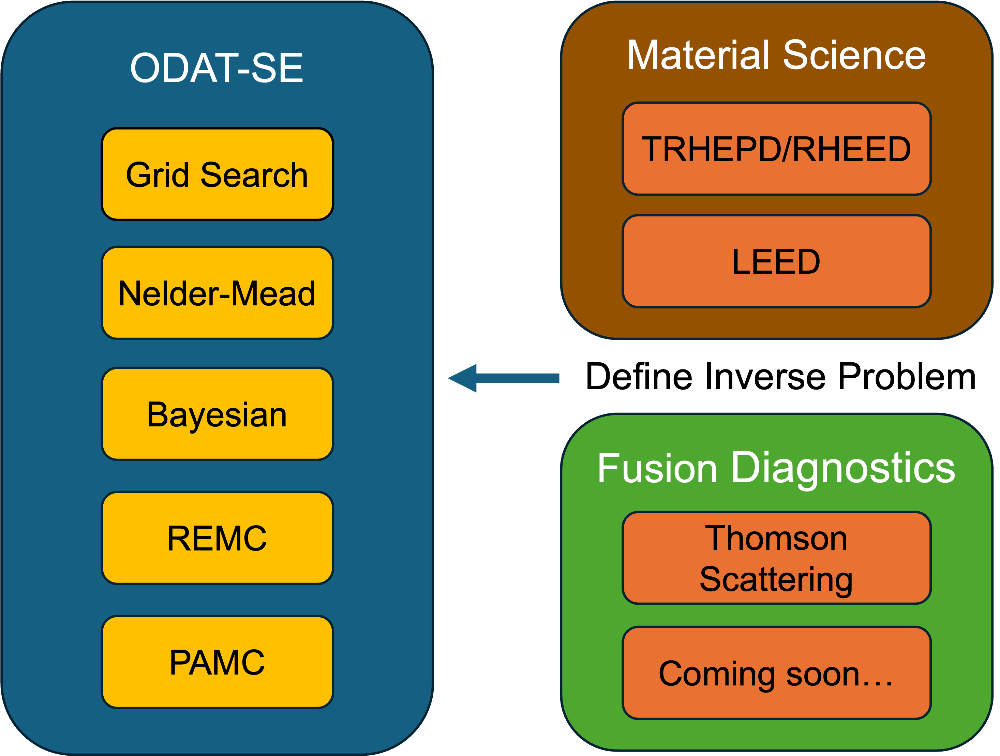

# ODAT-SE Fusion Application: Thomson Scattering Inverse Inference

Bayesian inverse inference of electron temperature ($T_e$) and density ($n_e$) from Thomson scattering diagnostics using [ODAT-SE](https://github.com/issp-center-dev/ODAT-SE), an open-source modular inverse problem solving platform.



## Highlights

- **Forward model**: Non-relativistic Thomson scattering spectrum with 5-channel polychromator
- **Five algorithms compared**: Nelder-Mead, Grid Search, Bayesian Optimization, Replica Exchange MC, Population Annealing MC (PAMC)
- **Bayesian model selection**: PAMC free energy distinguishes Maxwellian vs. Kappa EVDF ($\ln B = 13.7$, decisive evidence)
- **Validated with real LHD data**: Shot #175916 Thomson scattering profile (109 spatial points)
- **Performance**: Nelder-Mead 0.01s/point, PAMC 7s/point (full posterior + free energy)


## Documentation

- **[Technical Report](ODAT-SE_Thomson_Scattering_Analysis.md)** — Full analysis with theory, implementation, results, and benchmarks

## Quick Start

### Prerequisites

```bash
# Install ODAT-SE v3.0.0
pip install ODAT-SE[min_search,bayes]

# Additional dependencies
pip install matplotlib
```

### Run

```bash
# Run the full test suite (all tests + figure generation)
python run_tests.py

# Or run individual test sections:
python run_tests.py benchmark   # 5-algorithm comparison
python run_tests.py multipoint  # 5 radial positions (NM + PAMC)
python run_tests.py profile     # Full 109-point profile scan
python run_tests.py model       # Bayesian model selection
python run_tests.py perf        # Noise/coverage/scalability benchmarks
python run_tests.py figures     # Regenerate figures only
```

## Project Structure

```
├── README.md
├── ODAT-SE_Thomson_Scattering_Analysis.md   # Technical report
├── thomson_model.py                          # Forward model
├── generate_synthetic_data.py                # Synthetic data generator
├── run_tests.py                              # Comprehensive test suite
├── data/
│   └── thomson_175916.txt                    # LHD analyzed data (Shot #175916)
├── config/                                   # ODAT-SE TOML configurations
│   ├── minsearch.toml, mapper.toml, bayes.toml
│   ├── exchange.toml, pamc.toml
│   └── model_maxwell.toml, model_kappa.toml
├── model_selection/
│   └── run_model_selection.py
├── analysis/
│   └── plot_results.py
├── figures/                                  # Generated figures
└── results/                                  # Algorithm output (gitignored)
```

## Key Results

| Algorithm | $T_e$ error | $n_e$ error | Time/point | Use case |
|-----------|:-----------:|:-----------:|:----------:|----------|
| Nelder-Mead | ~5% | ~7% | 0.01 s | Quick estimates |
| PAMC | ~5% | ~7% | 7 s | Posterior + model selection |

## References

1. Y. Motoyama et al., *Comput. Phys. Commun.* **280**, 108465 (2022). [ODAT-SE]
2. I. Yamada et al., *J. Fusion Energy* **44**, 54 (2025). [LHD Thomson]
3. K. Yoshimi et al., arXiv:2505.18390 (2025). [ODAT-SE v3]
4. K. Saito et al., arXiv:2511.06330 (2025). [CHD Thomson + ODAT-SE]

## Acknowledgments

- ODAT-SE developed by ISSP, University of Tokyo
- LHD Thomson scattering data from NIFS (National Institute for Fusion Science)
- Supported by JST Moonshot Goal 10
