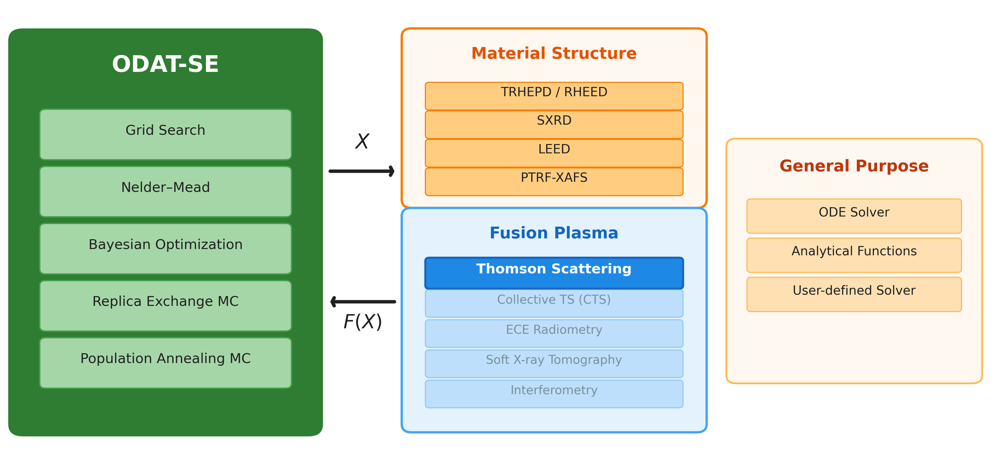
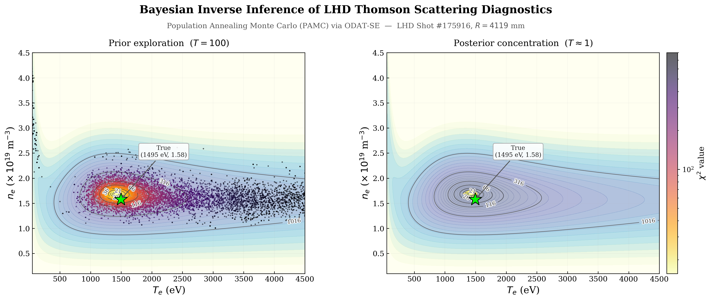

# ODAT-SE Fusion Application: Thomson Scattering Inverse Inference

Bayesian inverse inference of electron temperature ($T_e$) and density ($n_e$) from Thomson scattering diagnostics using [ODAT-SE](https://github.com/issp-center-dev/ODAT-SE), an open-source modular inverse problem solving platform.



## Highlights

- **Forward model**: Non-relativistic Thomson scattering spectrum with 5-channel polychromator
- **Five algorithms compared**: Nelder-Mead, Grid Search, Bayesian Optimization, Replica Exchange MC, Population Annealing MC (PAMC)
- **Bayesian model selection**: PAMC free energy distinguishes Maxwellian vs. Kappa EVDF ($\ln B = 13.7$, decisive evidence)
- **Validated with real LHD data**: Shot #175916 Thomson scattering profile (109 spatial points)
- **Performance**: Nelder-Mead 0.01s/point, PAMC 7s/point (full posterior + free energy)



## Documentation

- **[Technical Report](ODAT-SE_Thomson_Scattering_Analysis.md)** — Full analysis with theory, implementation, results, and benchmarks
- **[Build & Test Log](thomson_scattering/BUILD_AND_TEST_LOG.md)** — Step-by-step build and test record
- **[Application Design](ODAT-SE_Fusion_Application.md)** — Background and motivation document

## Quick Start

### Prerequisites

```bash
# Install ODAT-SE v3.0.0
cd /path/to/ODAT-SE-3.0.0
pip install -e ".[min_search,bayes]"

# Additional dependencies
pip install matplotlib
```

### Run

```bash
cd thomson_scattering/

# 1. Generate synthetic data
python generate_synthetic_data.py

# 2. Run all 5 algorithms
python run_all.py

# 3. Generate analysis plots
python analysis/plot_results.py

# 4. Run Bayesian model selection
python model_selection/run_model_selection.py

# 5. Run LHD-based validation (requires thomson@175916_1.txt)
python run_lhd_test.py
```

## Project Structure

```
thomson_scattering/
    thomson_model.py              # Thomson scattering forward model
    generate_synthetic_data.py    # Synthetic data generator
    run_all.py                    # Master benchmark script (5 algorithms)
    run_lhd_test.py               # LHD real-data validation
    minsearch/input.toml          # Nelder-Mead configuration
    mapper/input.toml             # Grid Search configuration
    bayes/input.toml              # Bayesian Optimization configuration
    exchange/input.toml           # Replica Exchange MC configuration
    pamc/input.toml               # Population Annealing MC configuration
    model_selection/
        run_model_selection.py    # Maxwell vs Kappa EVDF comparison
        input_maxwell.toml
        input_kappa.toml
    analysis/
        plot_results.py           # Visualization scripts
        figures/                  # All generated figures
```

## Key Results

| Algorithm | $T_e$ error | $n_e$ error | Time/point | Use case |
|-----------|:-----------:|:-----------:|:----------:|----------|
| Nelder-Mead | ~5% | ~7% | 0.01 s | Quick estimates |
| PAMC | ~5% | ~7% | 7 s | Posterior + model selection |

## References

1. Y. Motoyama et al., *Comput. Phys. Commun.* **280**, 108465 (2022). [ODAT-SE]
2. I. Yamada et al., *J. Fusion Energy* **44**, 54 (2025). [LHD Thomson]
3. K. Yoshimi et al., arXiv:2505.18390 (2025). [ODAT-SE v3]
4. K. Saito et al., arXiv:2511.06330 (2025). [CHD Thomson + ODAT-SE]

## License

This project is provided for academic and research purposes.

## Acknowledgments

- ODAT-SE developed by ISSP, University of Tokyo
- LHD Thomson scattering data from NIFS (National Institute for Fusion Science)
- Supported by JST Moonshot Goal 10
